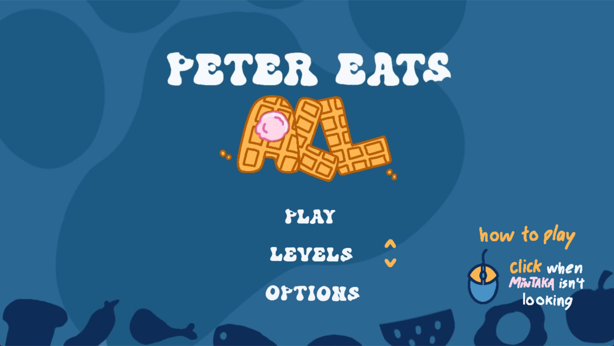

# Peter Eats All
Jogo desenvolvido com **Pygame** em **Python** para a disciplina de **Linguagem de Programação Aplicada**
## Como jogar?
Você é um cachorro chamado **Peter** e precisa comer tudo o mais rápido possível!    

&rarr; Clique com o mouse em qualquer lugar da tela enquanto Mintaka **NÃO** estiver olhando    
    
Se você clicar enquanto Mintaka estiver cozinhando, ela ficará nervosa e o jogo acabará    

&rarr; Coma tudo antes do tempo acabar!    
    
Ao acabar o jogo, você poderá reiniciar clicando na tecla **Enter** ou voltar ao menu clicando na tecla **Backspace**

## Agradecimentos
Tive a ajuda de um grande amigo em certas partes do código, como também para desenvolver todos os sons e músicas ambiente do jogo. Você pode encontrar o perfil dele [aqui](https://github.com/smolblackcat)! Obrigada [@smolblackcat](https://github.com/smolblackcat) <3

